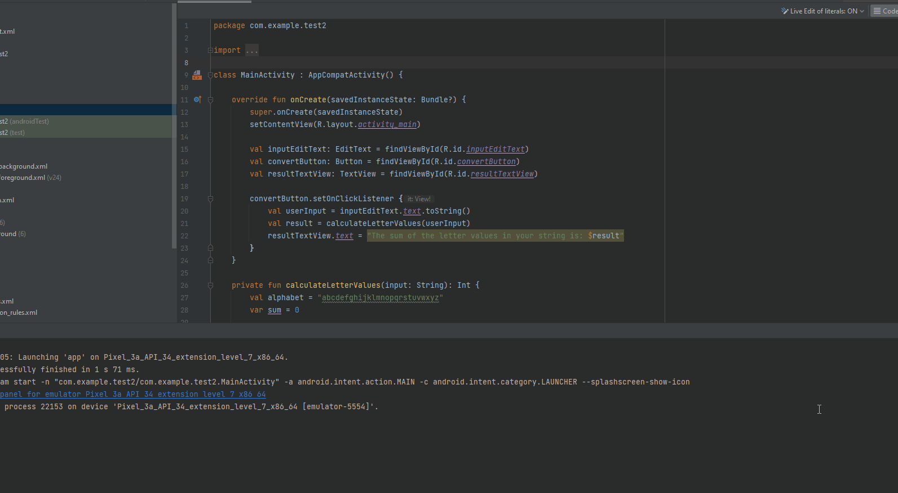

# Kotlin example

I created this simple Android app to test Kotlin functionalities.

## Scope of the app

I created this app to solve a [dailyprogrammer challenge](https://www.reddit.com/r/dailyprogrammer/comments/onfehl/20210719_challenge_399_easy_letter_value_sum/), where the objective was to assign every lowercase letter a value from 1 to 26 (a = 1, b = 2, c = 3, and so on), find the sum of the values and show it to the user.

